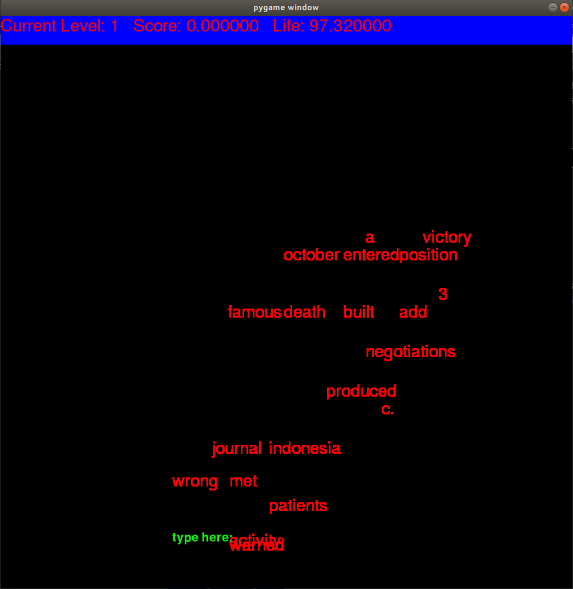

Submission to Korea University Hackathon 2017
4th Place
###need
python >=3.5
sklearn
numpy
pygame

###An image

####

We tried to visualised relative closeness of words with colours as well, which didn't work well. The word "beige" came with gray, - a combination of some RGB values - which we felt fine, but the word "banana" came with purple. I cannot find any excuse to associate banana with purple.

###referrence
https://nlp.stanford.edu/pubs/glove.pdf
